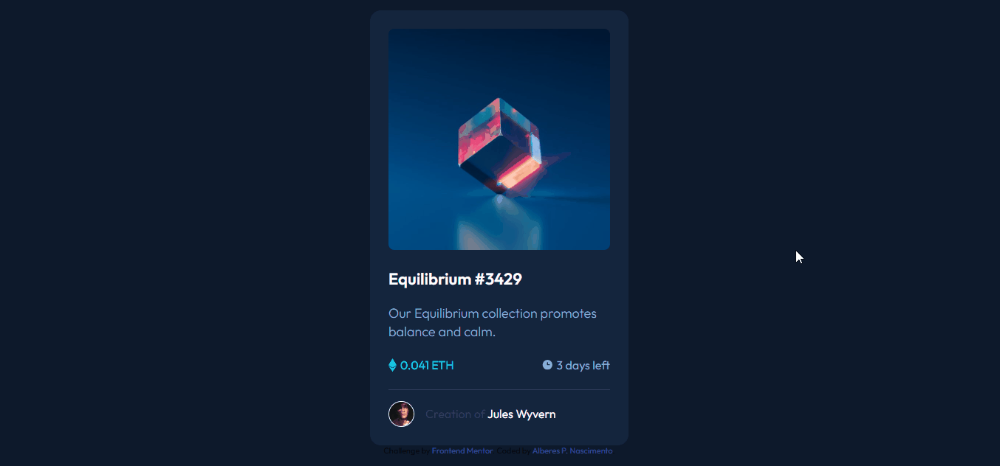

# NFT Preview Card Component

Este é um projeto de um componente de cartão de pré-visualização de NFT, criado como exercício para praticar habilidades de HTML e CSS. O design é baseado em um desafio do Frontend Mentor.

## Preview



## Tecnologias Utilizadas

- HTML
- CSS

## Estrutura de Pastas

```
📦 nft-preview-card-component
 ┣ 📂 src
 ┃ ┣ 📂 css
 ┃ ┃ ┣ 📜 reset.css
 ┃ ┃ ┣ 📜 style.css 
 ┃ ┃ ┗ 📜 variables.css
 ┃ ┣ 📂 design
 ┃ ┃ ┣ 🖼️ active-states.jpg
 ┃ ┃ ┣ 🖼️ desktop-design.jpg 
 ┃ ┃ ┣ 🖼️ desktop-preview.jpg 
 ┃ ┃ ┗ 🖼️ mobile-design.jpg 
 ┃ ┣ 📂 img
 ┃ ┃ ┣ 🖼️ favicon-32x32.png
 ┃ ┃ ┣ 🖼️ icon-ethereum.svg
 ┃ ┃ ┣ 🖼️ icon-clock.svg
 ┃ ┃ ┣ 🖼️ icon-view.svg
 ┃ ┃ ┣ 🖼️ image-avatar.png
 ┃ ┃ ┗ 🖼️ image-equilibrium.jpg
 ┣ 📜 index.html
 ┣ 📜 README.md
 ┗ 🖼️ preview.gif
```

## Como Usar

1. Clone este repositório:

```bash
git clone https://github.com/Alberesbass/nft-preview-card-component.git
```

2. Navegue até o diretório do projeto:

```bash
cd nft-preview-card-component
```

3. Abra o arquivo `index.html` no seu navegador da web.

## Licença

Este projeto está sob a licença MIT. Consulte o arquivo [LICENSE](./LICENSE) para obter mais informações.

---

Desenvolvido por [Alberes](https://github.com/Alberesbass)
